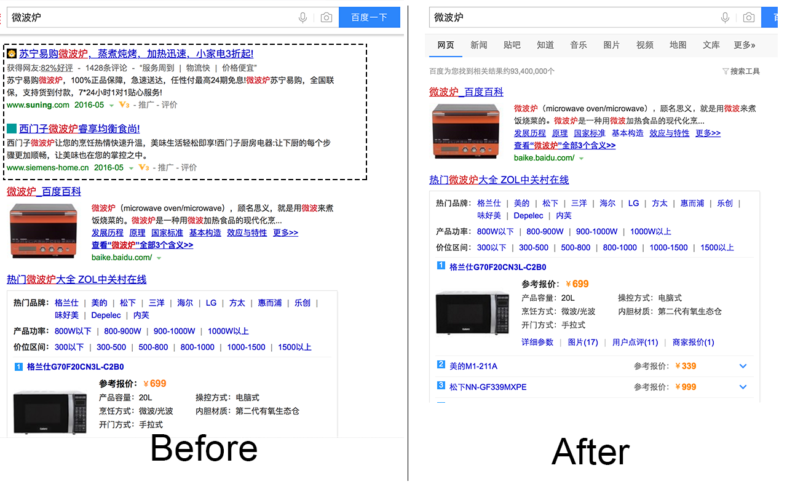
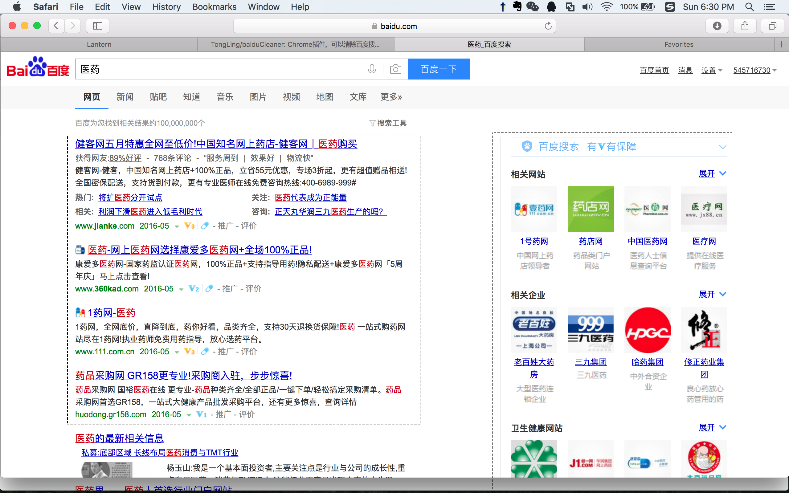
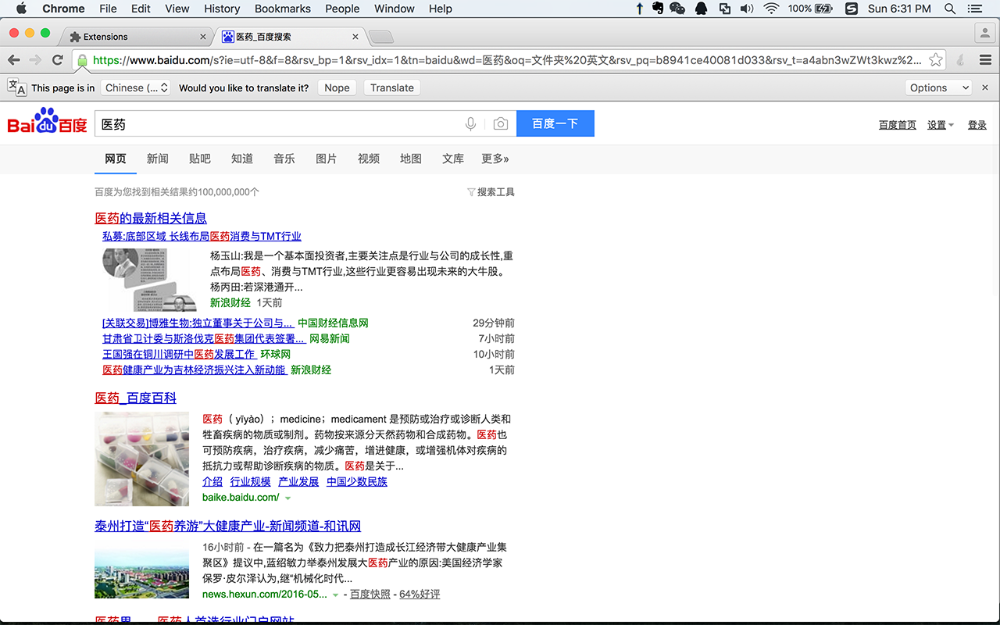

# baiduCleaner

BaiduCleaner is a plug-in installed on the Chrome browser. It can block most of Ads when presenting searching results. After using this plug-in, you can enjoy watching items without any ads.

Here is comparison before and after using this component.

---

##Version

1.0.1 -- Release in May 15, 2016
This version creates basic function -- to block fundamental Ads.

---

##QuickStart

To start to use it, you need to:

1. download this project and (if necessary) extract it.
2. open chrome, and type: `chrome://extensions/` in URL.
3. on the top of page, click `developer mode`.
4. click 'Load Unpacked extension' and choose baiduCleaner folder.
5. click 'Enabled'.

Enjoy using it!

---

##To do List
In the future, This component will:
* support more searching websites
* filter Ads completely

---

#baiduCleaner

baiduCleaner是一款去广告插件，可以帮助清除百度搜索结果页面中的所有带"推广"字样的链接。

使用前后效果对比：

---

##版本更新
1.0.1 -- 2016年 5月 15日 发布
添加了百度搜索页面中最基本的广告过滤功能

---
使用教程：

1、下载解压baiduCleaner.zip
2、打开chrome，URL输入chrome://extensions/
3、点击“开发者模式”
4、加载“已解压的扩展程序”，选择解压的文件夹
5、点击启用

享受没有广告的感觉吧！

---

##改进目标

未来这个插件将会支持
* 除了百度意外，更多的搜索网站
* 更加彻底的过滤广告策略
